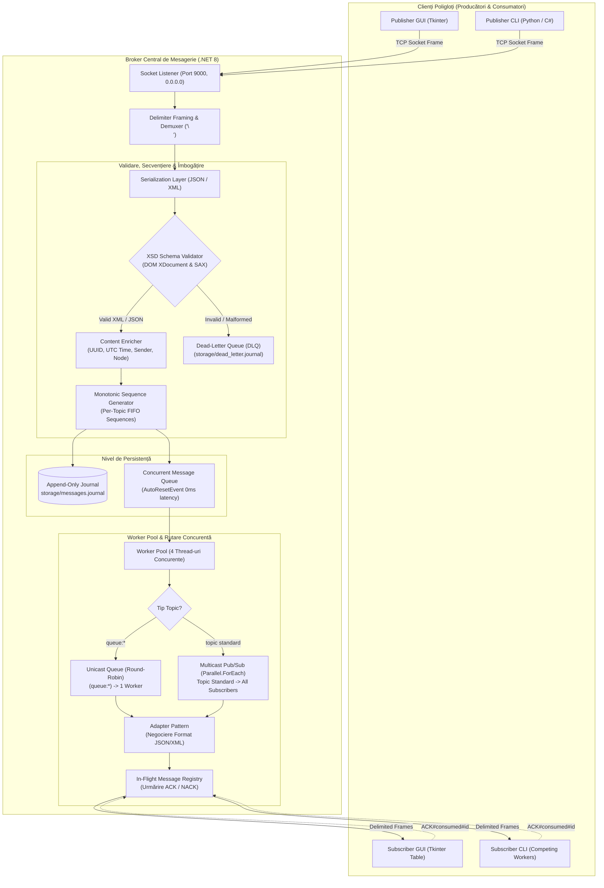
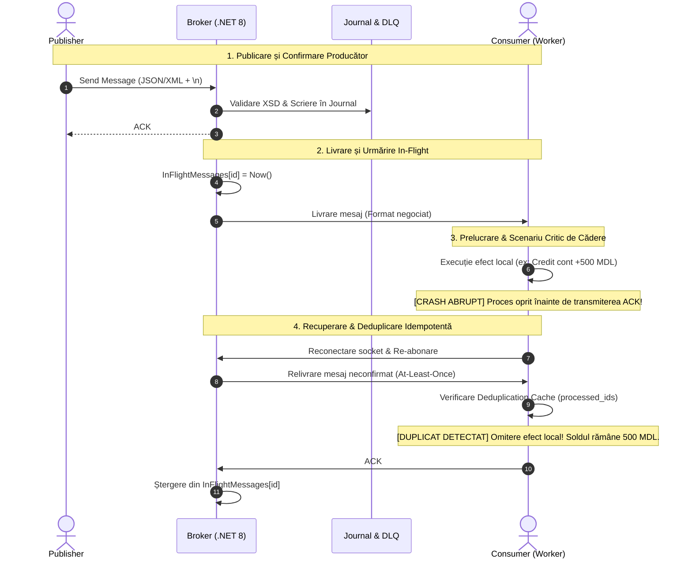
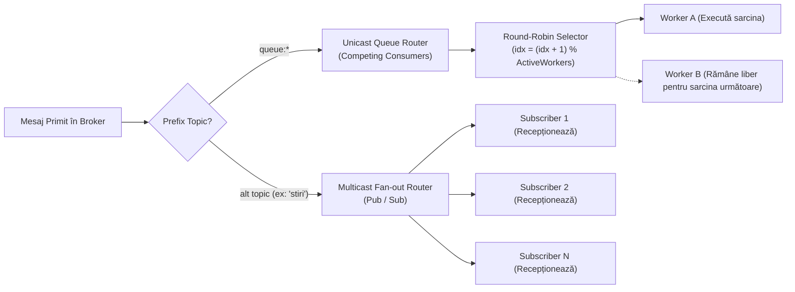

# Distributed Message Broker

Sistem distribuit asincron de mesagerie bazat pe socket-uri TCP, orientat pe evenimente (Event-Driven Architecture), proiectat pentru fiabilitate înaltă, persistență și reziliență în prezența latenței de rețea, eșecurilor de nod și duplicării mesajelor.

---

## 1. Arhitectura Sistemului

Sistemul decuplează complet producătorii (Publishers) de consumatori (Subscribers) din punct de vedere spațial și temporal. Nucleul sistemului este un Broker distribuit (.NET 8) ce expune un server TCP multi-threaded, un sistem de persistență bazat pe jurnal (Write-Ahead / Append-Only Log), un pool concurent de dispatching și un subsistem de validare a contractelor de date (JSON și XML).



---

## 2. Pilonii Tehnici și Modulele Arhitecturale

### 2.1. Nivelul de Transport și Delimitarea Pachetelor (Framing)
* **Transport:** TCP Sockets nativ (`System.Net.Sockets.Socket` în C#, modulul `socket` în Python).
* **Soluționarea problemei "Socket Stickiness" (TCP Packet Coalescing & Fragmentation):** Deoarece protocolul TCP funcționează ca un flux continuu de octeți (byte stream), lipsa delimitării poate duce la concatenarea mai multor mesaje într-un singur apel `recv` sau fragmentarea unui mesaj mare în mai multe pachete. Sistemul implementează **Delimiter-Based Framing** folosind caracterul newline (`\n` / `0x0A`).
* **Demultiplexare:** Modulul `Common/MessageFraming.cs` gestionează acumularea în buffer per conexiune și extragerea atomică a cadrelor complete, garantând deserializarea fără corupere.

---

### 2.2. Validare XML (XSD Schema) și Modelele de Prelucrare DOM vs. SAX
Sistemul oferă suport complet pentru prelucrarea structurată a datelor XML prin două modele complementare:
* **Contractul Formal XSD (`Common/PayloadSchema.xsd`):** Definește schema strictă a mesajelor (`topic`, `message`, `sender`, `id`, `timestamp`, `sequence_number`).
* **Modelul SAX (`XmlReader`):** Utilizat pentru streaming de mare viteză și consum minim de memorie ($\mathcal{O}(1)$ overhead), ideal pentru inspecția rapidă a tag-urilor.
* **Modelul DOM (`XDocument`):** Utilizat pentru încărcarea completă a arborelui în memorie, permițând validarea structurală împotriva schemei XSD și transformări structurale înainte de serializare.
* **Izolare în Dead-Letter Queue:** Orice mesaj XML malformat sau care încalcă schema XSD este automat respins cu codul `ERROR#malformed_payload` și direcționat în jurnalul DLQ (`storage/dead_letter.journal`).

---

### 2.3. Ordonarea Mesajelor (FIFO) și Secvențe Monotone
* Brokerul menține contoare atomice monotone crescătoare per-topic (`_topicSequences`).
* Fiecărui mesaj publicat pe un topic i se atribuie un `sequence_number` consecutiv ($1, 2, 3, \dots$).
* Consumatorii pot detecta pierderea pachetelor, duplicarea sau reordonarea prin verificarea consecutivității numerelor de secvență.

---

### 2.4. Fiabilitate Bidirecțională: Protocolul ACK / NACK și In-Flight Tracking
Confirmarea este decuplată și controlată la nivelul aplicației prin două bucle de feedback:

1. **Producer ACK (`ACK#published#<id>`):** Brokerul confirmă producătorului că mesajul a fost validat, îmbogățit (Content Enricher) și persistat pe disc în jurnal.
2. **Consumer ACK (`ACK#consumed#<id>`):** Consumatorul confirmă explicit că mesajul a fost recepționat și prelucrat cu succes. Brokerul șterge mesajul din registrul `InFlightMessages`.
3. **Consumer NACK (`NACK#<id>#<reason>`):** Dacă prelucrarea locală pe consumator eșuează, acesta emite un NACK, determinând brokerul să arhiveze mesajul în Dead-Letter Queue pentru investigații ulterioare.

---

### 2.5. Reziliență la Căderi: At-Least-Once Delivery + Consumator Idempotent

Într-un sistem distribuit real, un nod consumator poate executa un efect local (ex: tranzacție financiară), dar se poate prăbuși (crash fault, pană de curent) **înainte** ca pachetul de confirmare ACK să ajungă la Broker. În acest caz, Brokerul va retransmite mesajul la reconectare.

Pentru a atinge semantică de procesare **Exactly-Once** fără blocajele de performanță specifice protocoalelor Two-Phase Commit (2PC), sistemul aplică **Idempotent Consumer Pattern**:



$$\text{At-Least-Once Delivery (Broker)} + \text{Idempotent Consumer (Deduplication)} = \text{Exactly-Once Processing Effect}$$

---

### 2.6. Paradigme de Rutare: Multicast (Pub/Sub) vs. Unicast (Queues)

Sistemul suportă două moduri fundamentale de livrare a mesajelor în funcție de prefixul topicului:



1. **Multicast (Publish / Subscribe):**
   * Se aplică topicurilor standard (ex: `stiri`, `senzori`, `alerte`).
   * Mesajul este distribuit în evantai (*fan-out*) către **toți** abonații conectați la acel topic.
2. **Unicast (Point-to-Point Queue / Competing Consumers):**
   * Se aplică topicurilor prefixate cu `queue:` (ex: `queue:tasks`, `queue:jobs`).
   * Mesajul este distribuit către **un singur consumator activ**, selectat pe baza algoritmului **Round-Robin**. Acest mecanism asigură balansarea sarcinii de lucru (load leveling) între lucrători concurenți, fără duplicarea execuției.

---

### 2.7. Dead-Letter Queue (DLQ)
* Implementat în `storage/dead_letter.journal`.
* Izolează mesajele corupte, payload-urile care violează schema XSD, pachetele fără topic și mesajele respinse explicit prin NACK.
* Previne blocarea consumatorilor (protecție împotriva atacurilor de tip *poison pill*).

---

### 2.8. Adapter Pattern (Negociere Poliglotă de Format)
* Brokerul inspectează formatul de intrare și efectuează conversia structurală automată în formatul preferat de fiecare abonat (`JSON` sau `XML`).
* Un producător poate trimite mesaje în XML, iar un consumator Python le poate primi direct convertite în JSON nativ (sau invers).

---

## 3. Structura Proiectului

```
Agent-de-mesagerie/
├── Broker/                      # Motorul central de mesagerie (.NET 8)
│   ├── Program.cs               # Inițializare socket listener, worker pool, journal
│   ├── BrokerSocket.cs          # Nivelul de transport TCP asincron
│   ├── PayloadHandler.cs        # Rutare comenzi, validare, asignare secvențe, ACK/NACK
│   ├── ConnectionStorage.cs     # Gestiune conexiuni, subscripții, Round-Robin Queues
│   ├── Worker.cs                # Worker Pool concurent (4 thread-uri de distribuție)
│   ├── PayloadStorage.cs        # Jurnalizare persistentă și buffer în memorie
│   └── DeadLetterQueue.cs       # Izolare mesaje otrăvite / NACK / eronate
│
├── Common/                      # Biblioteca partajată de contracte și utilitare
│   ├── Payload.cs               # Modelul de date al mesajului cu atribute XML & JSON
│   ├── PayloadSchema.xsd        # Schema XSD de validare a mesajelor XML
│   ├── XmlValidation.cs         # Parsare hibridă SAX (XmlReader) și DOM (XDocument)
│   ├── SerializationHelper.cs   # Adapter Pattern (conversie bidirecțională XML/JSON)
│   ├── MessageFraming.cs        # Delimiter framing (\n) peste fluxul de octeți TCP
│   └── ConnectionInfo.cs        # Metadate conexiune, format preferat, InFlight tracking
│
├── Publisher/                   # Client producător în C# (.NET 8)
├── Subscriber/                  # Client consumator în C# (.NET 8) cu Deduplicare
│
├── Clients/Python/              # Clienți poligloți în Python
│   ├── publisher_ui.py          # Interfață Grafică Tkinter modernă pentru Publisher
│   ├── subscriber_ui.py         # Interfață Grafică Tkinter pentru Subscriber (Feed live)
│   ├── publisher.py             # Client consolă pentru publicare
│   └── subscriber.py            # Client consolă pentru recepție cu Idempotent Consumer
│
├── tests/                       # Suita completă de teste automate de verificare
│   ├── test_part1.py            # Verificare completă fluxuri Pub/Sub și Adapter
│   ├── test_xml_validation.py   # Validare XSD Schema și rejecție în DLQ
│   ├── test_ordering.py         # Verificare ordonare FIFO și numere de secvență
│   ├── test_consumer_ack.py     # Verificare protocol Consumer ACK / NACK
│   ├── test_unicast_queue.py    # Verificare Unicast (Queue) vs Multicast (Pub/Sub)
│   └── test_critical_scenario_crash_before_ack.py # Reproducere incident critic
│
├── docker-compose.yml           # Desfășurare containerizată Broker cu volum persistent
├── Dockerfile                   # Multi-stage Docker build pentru .NET 8 runtime
└── README.md                    # Documentație tehnică și ghid de utilizare
```

---

## 4. Ghid de Rulare

### Opțiunea A: Rulare Containerizată cu Docker Compose (Recomandat)

Lansează Brokerul într-un container complet izolat, cu volum de date mapat pentru persistență:

```bash
# Construiește imaginea și pornește containerul în background
docker compose up -d --build

# Urmărește logurile Brokerului în timp real
docker compose logs -f broker

# Oprirea containerului
docker compose down
```

---

### Opțiunea B: Rulare Nativă Locală

#### 1. Pornirea Brokerului
```bash
dotnet run --project Broker/Broker.csproj
```
Brokerul va inițializa socketul pe `0.0.0.0:9000`, va încărca mesajele din `storage/messages.journal` și va porni thread-urile din Worker Pool.

#### 2. Pornirea Interfețelor Grafice (UI)

* **Subscriber UI (Consumator):**
  ```bash
  python Clients/Python/subscriber_ui.py --name "Consumator-Alice"
  ```
  Permite conectarea la broker, abonarea la topicuri (`stiri`, `evenimente` sau `queue:sarcini`), comutarea în timp real a formatului preferat (JSON / XML) și inspectarea pachetului brut primit.

* **Publisher UI (Producător):**
  ```bash
  python Clients/Python/publisher_ui.py --name "Producator-Bob"
  ```
  Permite trimiterea continuă de mesaje pe orice topic sau coadă, selectarea formatului de transmisie (JSON sau XML) și vizualizarea confirmărilor `ACK#published#...`.

#### 3. Pornirea Clienților Consolă
```bash
# Consumator C#
dotnet run --project Subscriber/Subscriber.csproj

# Producător C#
dotnet run --project Publisher/Publisher.csproj

# Consumator Python CLI
python Clients/Python/subscriber.py
```

---

## 5. Verificare Automată și Teste End-to-End

Suita completă de teste poate fi executată direct prin Python împotriva unui Broker activ:

```bash
# 1. Integrare generală (Pub/Sub, Adapter XML<->JSON, Unsubscribe, Content Enricher)
python tests/test_part1.py

# 2. Validare XSD Schema și izolare payload-uri invalide în DLQ
python tests/test_xml_validation.py

# 3. Ordonare FIFO și numere de secvență per-topic
python tests/test_ordering.py

# 4. Protocolul bidirecțional Consumer ACK / NACK și In-Flight tracking
python tests/test_consumer_ack.py

# 5. Transmisiuni Unicast (Round-Robin Queue) vs Multicast (Pub/Sub)
python tests/test_unicast_queue.py

# 6. Reproducerea incidentului critic de haos (Crash înainte de ACK & Deduplicare)
python tests/test_critical_scenario_crash_before_ack.py
```

---

## 6. Referința Protocolului de Comunicație

Toate comenzile și cadrele de date sunt delimitate prin caracterul newline (`\n`):

| Comandă / Cadru | Direcție | Semnificație Arhitecturală |
|---|---|---|
| `subscribe#<topic>` | Client → Broker | Abonare durabilă la un topic (include replay istoric) |
| `subscribe#<topic>#live` | Client → Broker | Abonare efemeră (numai mesaje viitoare, fără replay istoric) |
| `subscribe#queue:<nume>` | Client → Broker | Înregistrare ca lucrător concurent pe o coadă Unicast |
| `unsubscribe#<topic>` | Client → Broker | Dezabonare dinamică de la un topic |
| `history#<topic>` | Client → Broker | Solicitare explicită a istoricului din jurnal |
| `topics#list` | Client → Broker | Interogare a topicurilor active în broker |
| `format#json\|xml` | Client → Broker | Negociere format primit (Adapter Pattern) |
| `ACK#consumed#<id>` | Consumator → Broker | Confirmare prelucrare cu succes (eliminare din registrul in-flight) |
| `NACK#<id>#<motiv>` | Consumator → Broker | Semnalare eroare de consum (direcționare payload în DLQ) |
| `ACK#published#<id>` | Broker → Producător | Confirmare stocare și îmbogățire payload (Content Enricher) |
| `ACK#subscribed#<topic>` | Broker → Consumator | Confirmare înregistrare subscripție |
| `ERROR#malformed_payload` | Broker → Client | Rejecție din cauza încălcării schemei XSD sau parsării |

---

## 7. Compromisuri Arhitecturale (Trade-offs)

1. **At-Least-Once Delivery vs. Exactly-Once Delivery pur la nivel de rețea:**
   * Conform *Teoremei celor doi generali* și limitărilor fundamentale ale protocolului TCP/IP, livrarea atomică exact-o-dată la nivel pur de transport este imposibilă în rețele nesigure.
   * Compromisul asumat este garantarea **At-Least-Once la nivel de transport** combinată cu **Idempotent Consumer la nivel de aplicație**, ceea ce asigură procesare efectivă Exactly-Once fără penalizări masive de latență prin blocaje 2PC (Two-Phase Commit).
2. **Jurnal Append-Only vs. Bază de Date Relațională:**
   * Utilizarea fișierelor jurnal (`storage/messages.journal` și `storage/dead_letter.journal`) oferă o complexitate de scriere $\mathcal{O}(1)$ și viteză maximă de I/O secvențial pe disc, eliminând dependențele externe pentru performanță sporită.
3. **Delimiter Framing (`\n`) vs. Length-Prefix Framing:**
   * Delimitarea prin caracter newline facilitează interoperabilitatea poliglotă imediată între C#, Python și utilitare standard de sistem (netcat/telnet), păstrând simplitatea, fiabilitatea și eficiența protocolului de mesagerie.
